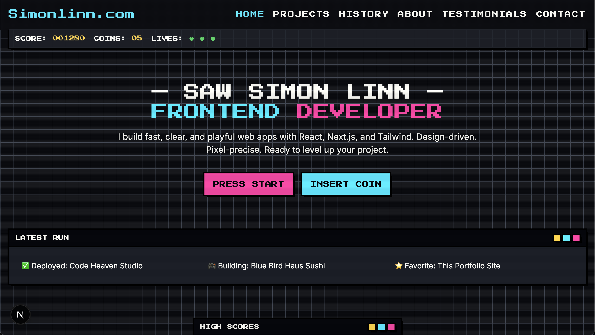

# Simon Linn — Arcade-Style Portfolio 🎮

This is my personal developer portfolio built with **Next.js**, **TypeScript**, and **Tailwind CSS**.  
The theme is inspired by retro arcade / pixel art aesthetics. It showcases my projects, work history, and experiments.

## 🚀 Features

- Arcade-inspired design with pixel-art styled project covers
- Fully responsive and mobile-friendly
- Dynamic project pages (`/projects/[slug]`)
- Light/Dark/Theme switching
- SEO-optimized and fast builds with Next.js
- CI/CD via Vercel

## 🛠 Tech Stack

- [Next.js 15](https://nextjs.org/)
- [React 18](https://react.dev/)
- [TypeScript](https://www.typescriptlang.org/)
- [Tailwind CSS 3.4](https://tailwindcss.com/)
- [Framer Motion](https://www.framer.com/motion/) (animations)
- [Appwrite](https://appwrite.io/) (backend for some apps)
- [Resend](https://resend.com/) (email)

## 📂 Project Structure

```
src/
  app/              # Next.js App Router pages
  components/       # UI components
  lib/              # Utilities and project data
  public/           # Static assets (covers, profile, pixel art)
```

## 🖼 Demo

🌐 [Live Demo](https://simonlinn.com)

## 📸 Screenshots

<p align="center">
  
</p>

## 🔧 Installation

Clone the repo and install dependencies:

```bash
git clone https://github.com/SawSimonLinn/simonlinn.com.git
cd simonlinn.com
npm install
```

Run locally:

```bash
npm run dev
```

Build for production:

```bash
npm run build
```

Deploy with Vercel:

```bash
vercel
```

## 📜 License

This project is open source under the MIT License.
